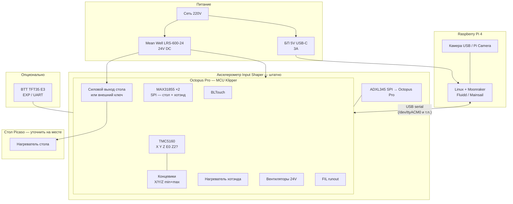

# Комплект электроники для 3D принтера

**Дата обновления:** март 2026

## Требования
- Плата управления с дисплеем
- **Сеть (оба интерфейса):** **Ethernet (RJ-45)** и **Wi‑Fi** — удалённое управление и передача файлов без обязательной проводки только по одному типу связи
- **Камера:** возможность подключить **веб‑камеру по USB** к узлу с веб‑интерфейсом (в комплекте — **Raspberry Pi 4B**: на плате есть **несколько USB**, один порт обычно занят связью с Octopus, остальные — под камеру и периферию)
- **Одноголовая конфигурация:** один хотэнд и один экструдер (EXTRUDERS 1); **желательно** заказывать **готовую сборку** хотэнд+экструдер (см. раздел «Печатающая головка»)
- Совместимость с PrusaSlicer
- Двигатели: 17HS4402NP1-22D (NEMA 17, 1.8°, 2.2A/фаза)
- **Установка на колёса:** две **разные** задачи — (A) качество слоя через Input Shaper, (B) стабильность корпуса через механику + настройки движения; см. раздел ниже
- **Калибровка и компенсация плоскости стола:** в комплекте заложен **контактный зонд BLTouch** (см. раздел «Какой датчик нужен для калибровки стола…») — он же задаёт нуль по Z для сопла; **акселерометр** в этом ТЗ для **стола не используется** (только для Input Shaper)

## Особенности принтера Picaso 3D Designer XL
- **Корпус и кинематика:** от Picaso 3D Designer XL
- **Область печати:** 360 x 360 x 610 мм (большой формат)
- **Кинематика:** Декартова (X-Y рельсовые направляющие, Z цилиндрические)
- **Количество осей:** X, Y, Z + 1 экструдер (минимум 4–5 двигателей, при двух Z — 5)
- **Температура экструдера:** до 410°C (требуются термопары K-типа)
- **Температура стола:** до 150°C
- **Направляющие:** X-Y рельсовые, Z цилиндрические (сталь)
- **Стол:** Стеклянный, нерегулируемый (без угловых винтов для выравнивания)
- **Компенсация геометрии:** ОБЯЗАТЕЛЬНА программная компенсация через **Mesh Bed Leveling**; для построения сетки и нуля по Z в данном комплекте используется **BLTouch** (см. ниже)
- **Зона очистки сопла** вне стола Picaso настраивается **координатами и макросами** (отдельный датчик не требуется)

---

## Поддержка предложенного комплекта в железе и софте

Ниже зафиксировано, **что из списка закупки** поддерживается **штатно** предлагаемым стеком ПО, без самописных ядер прошивки.

### Рекомендуемый стек ПО для этого проекта

| Уровень | Компонент | Назначение |
|---------|-----------|------------|
| Хост | **Raspberry Pi OS** (обычно Lite) | Система, сеть, USB |
| Печать | **Klipper** (хост на Pi + прошивка **MCU** на Octopus Pro) | Движение, нагрев, mesh, Input Shaper, датчики на MCU |
| API | **Moonraker** | Связь веб-интерфейса и Klipper, загрузка G-code, API для слайсера |
| Веб | **Fluidd** или **Mainsail** (на выбор) | Управление печатью, консоль, редактор `printer.cfg` (через веб) |
| Видео | **crowsnest** (или аналог под Moonraker) | Поток с **USB-камеры** в веб-интерфейс |
| Слайсер | **PrusaSlicer** | Профиль под Klipper; отправка по сети на Moonraker |

Связь **Pi ↔ Octopus Pro:** **USB** (serial), в `printer.cfg` секция `[mcu]`.

### Таблица: железо комплекта ↔ поддержка в ПО

| Железо (из BOM) | Где обрабатывается | Поддержка в софте (Klipper / экосистема) |
|-----------------|-------------------|----------------------------------------|
| **Octopus Pro** | Прошивка MCU | Образ **Klipper** для STM32; `[mcu]` |
| **TMC5160** | Слоты на Octopus | `[tmc5160]`, UART |
| **BLTouch** | Пины Octopus | `[bltouch]`, `[bed_mesh]`, калибровка Z |
| **Термопары K + MAX31855 ×2** | SPI MCU | Датчики температуры через драйвер MAX31855 в **Klipper** |
| **Оптические концевики ×6** | Входы MCU | `endstop_pin` у `[stepper_*]` |
| **Нагреватели, вентиляторы** | Выходы MCU | `[heater_*]`, `[fan_*]` |
| **Акселерометр §12.1** (на голове) | **Штатно: SPI к Octopus Pro** (`adxl345`); исключительно — I2C к Pi (`lis2dw`) | **Input Shaper** — [Measuring Resonances](https://www.klipper3d.org/Measuring_Resonances.html) |
| **Акселерометр §12.2** (корпус, опция) | Часто I2C Pi | **Не** отдельная встроенная «компенсация корпуса» в Klipper; только диагностика/скрипты при необходимости |
| **Raspberry Pi 4B** | Хост | Бинарь **Klipper**, **Moonraker**, веб; **не** заменяет MCU |
| **USB-камера** | USB Pi | **crowsnest** + настройки в Moonraker / Fluidd / Mainsail |
| **Ethernet, Wi‑Fi** | Интерфейсы Pi | Службы Linux; доступ к Moonraker по LAN |
| **Датчик филамента** (опция) | Вход MCU | `[filament_switch_sensor]` (или аналог по типу датчика) |
| **TFT35 E3** | EXP/UART | Зависит от **прошивки экрана BTT** и режима; для Klipper основной UI — **веб**; дисплей — опционально |

### Что считается штатной поддержкой

- Перечисленное для **Klipper + Moonraker + Fluidd/Mainsail** — **официальные** возможности из репозиториев и [klipper3d.org](https://www.klipper3d.org/), при корректном `printer.cfg` и актуальных версиях.
- **Octopus Pro** и **Klipper** совместимы: примеры конфигов в каталоге `config/` репозитория Klipper (`generic-bigtreetech-octopus-pro-v1*.cfg`).

### Ограничения (честно)

- **TFT35:** при несовпадении версии прошивки экрана и режима Klipper возможны ограничения; печать и настройка остаются через **веб**.
- **Задача B (качка корпуса):** не решается отдельным модулем в базовом Klipper — см. раздел про **две задачи** (механика + профиль ускорений).

Подробная **сводная шпаргалка по датчикам** — в `Список_покупок_электроники.md`.

---

## Установка на колёса: две независимые задачи (голова vs корпус)

Это **не** «один датчик решает всё». Нужно проектировать **два слоя**.

### Задача A — качество печати (след в пластике)

**Физика:** резонансы **кинематики** (ремни, каретка, типично **десятки–сотни Гц**), проявляются как рингинг.

**Решение в электронике/ПО:** **один** акселерометр на **печатающей голове** (рядом с соплом) + калибровка **Input Shaper** в **Klipper** на Raspberry Pi. Плата Octopus исполняет движение; **математика шейпера** — на Pi.

**Итог:** датчик на голове + `INPUT_SHAPER_CALIBRATE` / аналог — **обязательный минимум** для задачи A.

### Задача B — вибрация и качка **корпуса** (вся рама на колёсах)

**Физика:** **низкочастотная** болтанка основания, инерция всего станка (**ниже частот**, чем типичный Input Shaper).

**Честно про прошивку:** в **Klipper нет штатной** функции «второй датчик на корпусе постоянно подкручивает G-код и убирает качку рамы» в реальном времени. **Input Shaper не заменяет** жёсткую опору и не является компенсатором «плавающего» цеха.

**Решение «перепроектированное» под обе цели:**

| Слой | Что делает | Обязательность |
|------|------------|----------------|
| **Механика** | Стопоры колёс, **выдвижные опоры**, при необходимости **груз/связь с полом**, жёсткость точки опоры | **Обязательно** для задачи B |
| **Профиль движения** | Отдельный пресет в слайсере/Klipper: **ниже** `max_accel`, **ниже** `square_corner_velocity`, при необходимости скорость печати — чтобы **меньше возбуждать** корпус, пока он на колёсах/мягкой связи | Настоятельно для B |
| **Датчик на голове** | Input Shaper (задача A) | Как в BOM |
| **Датчик на корпусе** | **Не** для стандартного Input Shaper. **Опционально:** второй модуль акселерометра, закреплённый на **нижней раме/основании**, к **Raspberry Pi** (второй адрес на I2C или отдельная шина) — для **сравнения измерений до/после** установки опор, либо для скриптов/логов **низкочастотной** составляющей. Это **диагностика и контроль эффективности механики**, а не встроенная «автокомпенсация корпуса» в Klipper | По желанию |

**Практика без второго датчика:** один и тот же акселерометр **по очереди**: сначала на голове — полная калибровка Input Shaper; потом **перенести** на раму и **повторить** тестовые движения — сравнить «картину» до/после опор (вручную или скриптом). Так закрывается контроль задачи B **без** покупки второго чипа.

### В чём отличие от «обычных» вибраций (кратко)
Если принтер стоит на колёсах и во время печати опирается на них, возможна **низкочастотная раскачка всей рамы** (качка основания). Input Shaper сглаживает **резонансы кинематики у сопла**, но **не заменяет** устойчивую опору для **всего корпуса**: при «плавающем» станке задача B ограничена механикой и настройкой ускорений.

### Механика (обязательный минимум)
- **Стопоры колёс** или **поворотные ролики с тормозом** — чтобы во время печати корпус не катился.
- **Выдвижные опоры / ножки / домкраты** — чтобы в режиме печати вес шёл **на опоры**, а не на колёса (колёса только для перемещения).
- Жёсткая связь рамы с полом (при возможности) или противоскольжение под опоры.

### Электроника и прошивка (задача A — только Input Shaper)
Для задачи A на большом формате:
- **Klipper** на Raspberry Pi + **Input Shaper**;
- **один** акселерометр на **голове** — **в проекте закрепляем схему:** **ADXL345 по SPI на Octopus Pro** (см. раздел подключения); отступление на **LIS2DW к Pi** — только если **SPI к Octopus после всех мер** остаётся неработоспособен (не из‑за «длины жгута» как таковой);
- при необходимости **повторная** калибровка после перевозки или смены опор/колёс.

**Marlin** также поддерживает Input Shaping; для вашего стека чаще **Klipper**.

### Итог для ТЗ (обе задачи явно)
1. **Задача B (корпус):** в требованиях — **механическая стабилизация** при печати; отдельный **профиль ускорений** «мягкая опора / колёса» в слайсере и при необходимости в `[printer.cfg]`.
2. **Задача A (слой):** **акселерометр на голове** + процедуры измерения резонансов и **`INPUT_SHAPER_CALIBRATE`** (актуальные имена команд — в документации Klipper).
3. **Контроль задачи B без второго чипа:** тот же датчик **перенести на раму** и повторить тесты **до/после** опор — сравнить результат.
4. **Опционально:** **второй** акселерометр на **основании** к Pi — только для **постоянной диагностики** низких частот; **не** ожидать от Klipper авто-компенсации качки корпуса по этому каналу.

Подробный **поэтапный список закупки** с номерами модулей — в `Список_покупок_электроники.md`.

---

## Компенсация геометрии нерегулируемого стеклянного стола

### Проблема
Стол Picaso 3D Designer XL является **нерегулируемым** (без угловых винтов для выравнивания) и выполнен из стекла. Это означает, что:
- Невозможно механически выровнять стол
- Стекло может иметь неровности или быть установлено с перекосом
- Необходима **программная компенсация геометрии** через Mesh Bed Leveling

### Решение: Mesh Bed Leveling + BLTouch

#### Какой датчик нужен для калибровки стола и компенсации поверхности (в этом комплекте)

В проекте участвуют **два разных класса** измерений — их **нельзя путать**:

| Датчик | Для чего | Обязателен в комплекте? |
|--------|----------|-------------------------|
| **BLTouch** (сервоприводный контактный зонд) | **Нуль по Z**, построение **bed mesh** (компенсация неровностей и перекоса стола), повторяемое зондирование перед печатью | **Да** — это основной и рекомендуемый тип для данного ТЗ |
| **ADXL345** на Octopus (акселерометр; *отступление:* LIS2DW на Pi) | Калибровка **Input Shaper** (резонансы рамы/осей), **не** измеряет форму стола | Нет (но настоятельно рекомендуется для большого формата) |
| Индуктивный / ёмкостной датчик по Z | Альтернативы BLTouch | **Не входят** в гарантированную схему для **голого стекла** (см. ниже) |

**Почему для стеклянного стола Picaso зафиксирован именно BLTouch**

- **BLTouch** — **механический щуп** (касание стекла). Работает **на стекле** без металлической подложки и не зависит от толщины/типа покрытия так, как бесконтактные датчики.
- Поддержка в **Klipper** (`[bltouch]`, `[bed_mesh]`) и на **Octopus Pro** — **штатная** (разъём/пины probe и серво по документации BTT).
- **Оригинальный BLTouch** (ANT Labs, например **V3.1**) даёт наиболее предсказуемую повторяемость; **3DTouch** и аналоги — бюджетный вариант, чаще разброс по качеству.
- **Индуктивный** датчик на «чистом» стекле обычно **не видит** поверхность (нужен металл под стеклом или другая схема). **Ёмкостной** — капризен к материалам и настройке.
- **Вихретоковые датчики** (например **BIGTREETECH Eddy**): измеряют расстояние до **проводящей металлической** поверхности (индукция в металле). **На голом стекле Picaso не подходят** — стекло не даёт нужного эффекта вихревых токов; нужна **металлическая** кровать или накладка (сталь под PEI и т.п.) и проверка по инструкции BTT. Для вашего ТЗ («нерегулируемое стекло») базовый и предсказуемый вариант остаётся **BLTouch** (касание).
- Схемы **Klicky / Euclid** и т.п. — вне базового BOM; при желании можно заменить BLTouch позже, предварительно изучив совместимость с кинематикой Picaso.
- Наборы «**Eddy + Octopus Max EZ + BTT Pi**» на маркетплейсах — **другая** плата (**Max EZ**, не **Octopus Pro** из этого проекта) и другой SBC; перед покупкой сверяйте с текущим списком комплектующих и с тем, что стол у вас **стекло**, если не планируете смену поверхности под Eddy.

**Итог по закупке под «гарантированно работает с комплектом Octopus Pro + Klipper + стекло»:** заказывайте **один BLTouch** (желательно оригинал **V3.1**); в `printer.cfg` — секции `[bltouch]` и `[bed_mesh]` по примеру для Octopus Pro.

---

**BLTouch (датчик автолевелинга по столу) — ОБЯЗАТЕЛЬНО для mesh и Z=0:**
- Создаёт сетку точек на столе (рекомендуется 5×5 для стола 360×360)
- Измеряет высоту в каждой точке касанием
- Прошивка компенсирует неровности при печати

**Настройка в прошивке:**
- **Marlin:** `MESH_BED_LEVELING` / `AUTO_BED_LEVELING_BILINEAR` и параметры BLTouch.
- **Klipper:** секции `[bltouch]`, `[bed_mesh]` (сетка, например 5×5; отступы 10–15 мм); сохранение в `printer.cfg` / `SAVE_CONFIG`.
- Сетка 5×5 точек (для большого стола)
- Автоматическое применение компенсации при печати (загрузка профиля в G-code старта)

**Процедура калибровки:**
1. Установить BLTouch на головку принтера
2. Запустить создание сетки: в **Marlin** часто `G29`; в **Klipper** — `BED_MESH_CALIBRATE` (или эквивалент из веб-интерфейса)
3. Сохранить карту (в Klipper — `SAVE_CONFIG` после калибровки)
4. При каждой печати компенсация применяется по стартовому G-code

**Альтернатива (менее точная):**
- Ручная компенсация через `MESH_BED_LEVELING` с ручным зондированием
- Менее удобно, но возможно без BLTouch

**Связь с зоной очистки сопла (вне стола):** для перемещения в лоток/на щётку BLTouch **не обязателен** — нужны только **лимиты осей** и **макрос** с координатами (см. следующий раздел).

---

## Зона очистки / промывки сопла (место за пределами стола Picaso)

У корпуса Picaso 3D Designer XL обычно есть **штатная механическая зона** (ёмкость для сброса, щётка/подложка и т.п.) **вне рабочего поля стола**. В подобранном **электронном** комплекте **отдельных деталей под это не требуется**: те же двигатели и плата обеспечивают перемещение головы в любую допустимую точку по X/Y/Z.

**Как это «решается» после перехода на Octopus Pro + Klipper:**

1. **Механика** — по возможности сохранить оригинальный узел (лоток, щётку, крепления). Если разобрано — восстановить положение по мануалу Picaso или по размерам корпуса.
2. **Пределы осей в Klipper** — в `[stepper_x]` / `[stepper_y]` (и при необходимости Z) параметры **`position_min` / `position_max`** должны покрывать **полный ход**, включая зону очистки **за пределами** 360×360 мм стола. Иначе прошивка **обрежет** перемещения и головка **не доедет** до штатного места. Размеры области печати (`[bed_mesh]` и т.д.) задаются **отдельно** и не обязаны совпадать с `position_max`.
3. **Логика очистки** — не «железо», а **макросы и G-code**:
   - в **`printer.cfg`** — макрос, например `[gcode_macro PURGE]` / `CLEAN_NOZZLE`: переезд в измеренные координаты зоны, выдавливание пластика, при необходимости несколько проходов над щёткой;
   - в **PrusaSlicer** (или другом слайсере) — в **стартовом G-code** вызов этого макроса (`PURGE` / `CLEAN_NOZZLE`) до или после нагрева, по вашей схеме.
4. **Координаты** — снять **после калибровки** столового нуля и осей: руками через веб-интерфейс (Fluidd/Mainsail) или `G1` подобрать X/Y над лотком/щёткой и записать в макрос. Оригинальные значения из прошивки Picaso можно использовать как **ориентир**, если найдёте их в старом конфиге.
5. **BLTouch** — зона очистки обычно **вне сетки** `bed_mesh`; для перемещений туда зонд не обязателен, важны только лимиты и безопасная высота Z.

**Итог:** в комплекте электроники **ничего дополнительно покупать** для «места чистки» не нужно; нужно **расширить программные лимиты** под полный ход Picaso и **прописать макрос + стартовый G-code** под координаты штатной зоны.

---

## Распределение двигателей для Picaso 3D Designer XL

**Минимальная конфигурация (4 двигателя):**
- X-ось: 1 двигатель (17HS4402NP1-22D)
- Y-ось: 1 двигатель (17HS4402NP1-22D)
- Z-ось: 1 двигатель (17HS4402NP1-22D)
- E0 (экструдер): 1 двигатель (17HS4402NP1-22D)

**Рекомендуемая конфигурация (5 двигателей):**
- Если оригинальный Picaso имел 2 двигателя для Z-оси (синхронизация большого стола), добавьте второй Z-двигатель: X, Y, Z1, Z2, E0

**Примечание:** Проверьте оригинальную конфигурацию Picaso 3D Designer XL — возможно, там использовались 2 двигателя для Z-оси.

---

## Рекомендуемый комплект

### Вариант 1: BigTreeTech Octopus Pro (Рекомендуется)

#### Основная плата управления
**BigTreeTech Octopus Pro V1.0** (РЕКОМЕНДУЕТСЯ)
- 8 слотов для драйверов шаговых двигателей (TMC2209/TMC5160)
- Поддержка до 4 экструдеров (для одного хотэнда с большим запасом)
- 5V/3.3V логика
- Поддержка 12V/24V систем
- Разъемы для подключения дисплея
- Достаточно выходов для большого принтера (360x360x610)
- **Цена:** ~$60-80

**Альтернатива:** BigTreeTech Octopus V1.1 (более бюджетная, ~$40-50)
- Также подходит, но Octopus Pro имеет лучшую защиту и больше функций

#### Сеть + камера: Raspberry Pi 4B (узел Klipper и веб-интерфейса)
**Raspberry Pi 4B (2GB или 4GB) + Klipper (хост) + Moonraker + Fluidd/Mainsail** (РЕКОМЕНДУЕТСЯ)

По требованиям ТЗ **одновременно закрываются:**
- **Ethernet (RJ-45)** и **Wi‑Fi 802.11ac** — оба интерфейса **на самой Pi 4B** (отдельный USB‑Ethernet адаптер не нужен).
- **USB‑камера** — подключается к **USB‑разъёмам Raspberry Pi** (не к Octopus). Для стрима в Fluidd/Mainsail обычно используют **crowsnest** (или аналог); разрешение и FPS зависят от камеры и нагрузки на Pi.
- **Занятость USB:** один порт часто уходит на **USB‑кабель к Octopus** (Klipper); для камеры остаются **другие USB‑порты Pi** (при нехватке — питание камеры с активного USB‑хаба с БП).

Дополнительно:
- Удалённое управление через веб-интерфейс (основной сценарий для Klipper)
- Интеграция с PrusaSlicer: **Moonraker** (HTTP API), профиль принтера под Klipper
- **Klipper:** на Pi — планировщик и `printer.cfg`; на Octopus Pro — прошивка только MCU
- Связь с платой: **USB** (USB-A на Pi → USB на Octopus) или UART по гайду Klipper; для старта проще **USB**

**Цена Pi:** ~$50-70 (камера заказывается отдельно — см. список покупок)

**Альтернатива:** BigTreeTech ESP32 WiFi Module
- Встроенный ESP32 для WiFi
- Поддержка Ethernet через USB адаптер
- Совместим с Octopus Pro
- Менее функционально, но дешевле
- **Цена:** ~$15-20

#### Драйверы шаговых двигателей

**Сравнение TMC2209 vs TMC5160 для большого принтера 360x360x610:**

| Параметр | TMC2209 | TMC5160 |
|----------|---------|---------|
| **Максимальный ток** | 2.2A RMS | 10A RMS |
| **Напряжение** | До 28V | До 60V |
| **Микрошаги** | До 1/256 | До 1/256 |
| **Точность** | Хорошая | Отличная |
| **Скорость** | До 2000 шагов/сек | До 2000+ шагов/сек |
| **Управление током** | Базовое | Продвинутое (StallGuard2, CoolStep) |
| **Синхронизация** | Хорошая | Отличная (важно для больших принтеров) |
| **Цена** | $8-12 | $15-20 |
| **Для NEMA17** | ✅ Оптимально | ⚠️ Избыточно, но лучше |

**Рекомендация для Picaso 3D Designer XL:**

**Вариант A: TMC2209 (Бюджетный, достаточный)**
- ✅ Подходит для двигателей 17HS4402NP1-22D (2.2A)
- ✅ Тихая работа
- ✅ Достаточная точность для большинства задач
- ✅ Низкая цена
- ⚠️ Может быть недостаточно для очень высоких скоростей на большом принтере
- **Цена:** ~$8-12 за штуку (5 шт под оси + запас ≈ $40-60)

**Вариант B: TMC5160 (Рекомендуется для большого принтера)**
- ✅ **Лучшая точность** на больших расстояниях (360x360x610)
- ✅ **Лучшая синхронизация** осей (критично для большого принтера)
- ✅ **Продвинутое управление током** (StallGuard2, CoolStep)
- ✅ **Лучшая работа на высоких скоростях** (важно для большого объема печати)
- ✅ **Более плавное движение** (меньше вибраций на больших расстояниях)
- ✅ **Запас мощности** для будущих модернизаций
- ⚠️ Выше цена
- ⚠️ Избыточен для NEMA17, но дает преимущества
- **Цена:** ~$15-20 за штуку (5 шт под оси + запас ≈ $75-100)

**Итоговая рекомендация: TMC5160 для Picaso 3D Designer XL**

**Почему TMC5160 лучше для вашего принтера:**
1. **Большая область печати (360x360x610):**
   - TMC5160 обеспечивает лучшую точность на больших расстояниях
   - Меньше накопления ошибок при длинных перемещениях
   - Лучшая синхронизация между осями

2. **Высокая скорость печати:**
   - Для большого объема печати важна скорость
   - TMC5160 лучше работает на высоких скоростях без потери точности

3. **Продвинутые функции:**
   - StallGuard2 - защита от заклинивания
   - CoolStep - автоматическая регулировка тока (экономия энергии)
   - Более точное управление микрошагами

4. **Один экструдер:**
   - TMC5160 обеспечивает плавную и точную подачу филамента

**Распределение драйверов:**
- X, Y, Z, E0 (минимум 4) + при двух Z: Z2; + 1 запасной = **5 штук** (или 6 при двух Z)

**Примечание:** Если бюджет ограничен, TMC2209 тоже подойдет, но для максимального качества на большом принтере рекомендуется TMC5160.

#### Дисплей
**BigTreeTech TFT35 E3 V3.0**
- 3.5" цветной сенсорный экран
- С **Klipper** основной интерфейс — **браузер** (Fluidd/Mainsail на Pi); TFT — **дополнительный** локальный дисплей
- Подключение: кабели **EXP1/EXP2** к Octopus (как у семейства BTT) **или** режим с последовательным подключением к Pi — зависит от прошивки экрана; актуальная схема — в Wiki BTT и документации Klipper Screen / репозитория TFT
- Режим эмуляции Marlin у BTT часто используют с Marlin; для Klipper проверьте совместимую ветку прошивки дисплея
- **Цена:** ~$35-45

**Альтернативы:**
- BTT TFT43 V3.0 (4.3", ~$50)
- BTT TFT50 V3.0 (5.0", ~$60)

#### Термопары/Термисторы
**Термопары K-типа - 2 штуки** (ОБЯЗАТЕЛЬНО для Picaso 3D Designer XL)
- 1 для стола (bed) - до 150°C
- 1 для хотэнда - до 410°C (термопары обязательны!)
- Термопары K-типа с усилителем MAX31855 или MAX31865
- **Цена:** ~$3-5 за термопару + ~$5-8 за усилитель

**ВАЖНО:** Для температуры экструдера до 410°C термисторы НЕ подходят! Только термопары K-типа.

**Модули усилителей термопар (важно для совместимости):**
- Для **термопар K-типа** (как в этом ТЗ): **MAX31855** (варианты на K-тип, часто маркируют MAX31855K) — **2 штуки** (стол + хотэнд).
- **MAX31865** рассчитан на **PT100/PT1000**, а не на K-тип: применять только если вы **откажетесь от термопары** и поставите соответствующий датчик под MAX31865. **Не смешивать** «K-термопара + MAX31865» без доработки схемы.
- Подключение к MCU в Klipper — по **SPI** (отдельный CS на каждый модуль или общая шина — по пинам Octopus и `printer.cfg`).
- **Цена:** ~$5-8 за модуль

#### Нагреватели
**Нагреватель стола (Bed Heater)**

В проекте **механика и стол Picaso сохраняются** — отдельно покупать силиконовый стол 500–600 W **не обязательно**, если заводской нагреватель исправен и совпадает по **напряжению** с выбранной схемой питания.

- **Перед заказом БП и силовой цепи:** измерьте/уточните у **оригинального стола Picaso**:
  - **24 V DC** — типично для крупных принтеров; ток пика \(I \approx P/24\) (например 500 W → ~21 A). Тогда цепь: **24V БП → ключ (см. ниже) → нагреватель**, общий **минус** с платой.
  - **220 V AC** (нагреватель на сеть) — управление только через **SSR для AC** (и разводка силовая силами электрика); логика с Octopus — по схеме производителя/модуля.
- Если стол **24 V** и мощный: **штатный силовой MOSFET на Octopus Pro может не выдержать ток** — часто ставят **внешний MOSFET-модуль (DC)** или силовой ключ на подходящих MOSFET с радиатором. **Классические «SSR-25DA» с маркировкой под AC** для **DC-стола не подходят** — нужен ключ на **постоянку** с нужным током.
- Покупка **нового** силиконового нагревателя 24 V 500–600 W — только если меняете стол или старый неисправен (**~$30–50**).

**Ключ/реле для стола (выбрать под фактическое питание стола):**
- **DC 24 V стол:** MOSFET-модуль / низкое сопротивление MOSFET + радиатор, номинал по току с запасом (не «AC SSR»).
- **AC 220 V стол:** SSR с подходящей нагрузкой и типом управления (3–32 V DC на входе — проверить даташит).
- **Цена:** ~$8–25 в зависимости от типа

**Нагреватель хотэнда - 1 штука**
- 24V 40W или 24V 50W (для высоких температур до 410°C)
- Картридж с керамическим изолятором для высоких температур (стандарт V6, 6мм)
- **Цена:** ~$5-8

#### Блок питания
**Mean Well LRS-600-24 (24V)** (РЕКОМЕНДУЕТСЯ для Picaso 3D Designer XL)
 - 600W мощности (необходимо для большого стола 360×360 и одного хотэнда, с запасом по пикам)
- Расчет: стол 500-600W + хотэнд 50W + двигатели ~100W + вентиляторы ~50W = ~700W пиковая
- Защита от перегрузки
- **Цена:** ~$40-55

**Альтернатива:** Mean Well LRS-500-24 (24V)
- 500W мощности (минимум для этого принтера)
- Может быть недостаточно при одновременном нагреве стола и хотэнда
- **Цена:** ~$35-45

**Дополнительно:** Блок питания 5V для Raspberry Pi
- Mean Well LRS-15-5 (5V, 15W) или USB адаптер
- **Цена:** ~$5-10

**ВАЖНО:** Для принтера такого размера (360x360x610) с мощным столом обязательно нужен блок питания с запасом мощности!

#### Дополнительные компоненты

**Мощный MOSFET модуль**
- Для управления хотэндом (если плата не имеет встроенного) - 1 штука
- Для стола лучше использовать SSR (см. выше)
- **Цена:** ~$3-5

**Оптические концевики (фотоэлементы прерывания) - ОБЯЗАТЕЛЬНО**
- **Модули оптических концевиков с прерыванием луча** - 6 штук (по 2 на каждую ось)
- **X-ось:** минимум (X_MIN) и максимум (X_MAX) - 2 модуля
- **Y-ось:** минимум (Y_MIN) и максимум (Y_MAX) - 2 модуля
- **Z-ось:** минимум (Z_MIN) и максимум (Z_MAX) - 2 модуля
- Тип: модули с ИК-светодиодом и фотоприемником (прерывание луча)
- Рабочее напряжение: 5V или 12V (в зависимости от модели)
- Выход: цифровой (HIGH/LOW) или аналоговый
- **Рекомендуемые модели:**
  - Omron EE-SX671 (компактные, надежные)
  - Оптические модули от AliExpress (клоны Omron)
  - Модули с разъемом JST для удобного подключения
- **Цена:** ~$3-6 за модуль (комплект 6 шт: ~$18-36)

**ВАЖНО:** Оптические концевики более точные и надежные, чем механические, особенно для большого принтера. Они не изнашиваются и не требуют физического контакта.

**Установка оптических концевиков:**
- **X_MIN:** на левом краю (начало стола по X)
- **X_MAX:** на правом краю (конец стола по X, 360 мм)
- **Y_MIN:** на переднем краю (начало стола по Y)
- **Y_MAX:** на заднем краю (конец стола по Y, 360 мм)
- **Z_MIN:** в нижней точке (начало по Z, обычно на столе)
- **Z_MAX:** в верхней точке (конец по Z, 610 мм)

**Флаги прерывания:**
- На каретке X установите флаг для прерывания луча X_MIN и X_MAX
- На каретке Y установите флаг для прерывания луча Y_MIN и Y_MAX
- На каретке Z установите флаг для прерывания луча Z_MIN и Z_MAX

**Примечание:** Для большого принтера (360x360x610) концевики максимума особенно важны для предотвращения выхода за пределы рабочей области.

**Датчик для mesh стола и нуля по Z (ОБЯЗАТЕЛЬНО) — см. раздел «Какой датчик нужен для калибровки стола…» выше**
- **BLTouch** (оригинал **V3.1** или клон **3DTouch**) — **единственный заложенный в комплект** тип зонда для **стекла** и Klipper на Octopus Pro.
- Индуктивные/ёмкостные альтернативы в базовый комплект **не входят** (см. обоснование в начале документа).
- **Цена:** ~$15-35 в зависимости от оригинал/клон

**Акселерометр (Input Shaper) — не путать со столом**
- **ADXL345** (на Octopus) — только **резонансы осей**, **не** плоскость стола; подробности — в разделе про колёса и в списке покупок §12.

**Датчик окончания пластика (опционально, рекомендуется)**
- Останавливает печать при окончании филамента, даёт возможность сменить катушку без потери детали
- Типы: механический (филамент нажимает на рычаг/кнопку), оптический (прерывание луча), с микровыключателем
- Подключение: отдельный вход на плате (например FIL_RUNOUT_PIN в Marlin)
- **Цена:** ~$5-15

**Вентиляторы**
- Вентилятор охлаждения хотэнда - 1 штука (24V, 4010 или 4020)
- Вентилятор обдува детали - 1 штука (24V, 5010 или 5020)
- **Цена:** ~$3-5 за штуку

**Кабели и разъемы**
- Провода для двигателей (4-жильные, сечение 0.5-0.75мм²)
- Провода для нагревателей (сечение 1.5-2.5мм²)
- Разъемы Molex/JST
- **Цена:** ~$15-25

**Печатная плата для подключения (опционально)**
- Для удобного подключения всех компонентов
- **Цена:** ~$10-15

---

### Вариант 2: BigTreeTech SKR 3 EZ (Бюджетный)

#### Основная плата управления
**BigTreeTech SKR 3 EZ**
- 5 слотов для драйверов (достаточно для 1 экструдера и осей X, Y, Z)
- Поддержка WiFi модуля
- Более компактная
- **Цена:** ~$40-50

#### WiFi модуль
**BigTreeTech ESP32 WiFi Module** (совместим с SKR 3)
- **Цена:** ~$15-20

#### Остальные компоненты
- Аналогичны Варианту 1

---

## Поэтапная закупка (модулями)

Ниже логика «купить частями»: после каждого этапа можно остановиться, пока не готов следующий блок работ.

| Этап | Содержание | Результат (критерий готовности) |
|------|------------|--------------------------------|
| **M0** | Механика колёс: стопоры + выдвижные опоры | Принтер стоит устойчиво, без проката при печати |
| **M1** | Octopus Pro, драйверы, Raspberry Pi 4B (**Ethernet + Wi‑Fi** на плате), БП 5V для Pi, карта памяти, по ТЗ — **USB‑камера** | Собран «мозг», прошит Klipper, есть **LAN или Wi‑Fi**, веб‑интерфейс; камера в **отдельный USB** Pi |
| **M2** | БП 24V, SSR/силовая цепь стола (по факту стола Picaso), проводка безопасности | Силовая часть согласована с напряжением/мощностью стола |
| **M3** | Концевики, **BLTouch** (mesh + Z сопла), проводка осей | Гоминг, пределы, **bed mesh** на стекле |
| **M4** | Термопары, MAX31855, нагреватель хотэнда, вентиляторы, **головка в сборе** (хотэнд+экструдер) | Нагрев и охлаждение одной головы |
| **M5** | Дисплей TFT, кабели, мелкая обвязка | Локальное управление и аккуратный монтаж |
| **M6** | Акселерометр, калибровка Input Shaper в Klipper | Снижены артефакты от резонансов при выбранных опорах |

Детализированные списки по позициям и ценам — в `Список_покупок_электроники.md`.

---

## Итоговая стоимость комплекта

### Вариант 1 (Octopus Pro + Raspberry Pi):
- Плата управления: $60-80
- Raspberry Pi 4B: $50-70
- Драйверы (5x TMC5160 или TMC2209): $75-100 / $40-60
- Дисплей: $35-45
- Термопары K-типа (2 шт): $6-10
- Усилители MAX31855 (2 шт): $10-16
- Нагреватель стола (если меняете/покупаете новый 24 V 500–600 W): $30-50 — **часто не нужен**, стол остаётся от Picaso
- Ключ/реле/MOSFET под фактическое питание стола: $8-25
- Нагреватель хотэнда (1 шт): $5-8
- Блок питания 24V 600W: $40-55
- Блок питания 5V для Pi: $5-10
- MOSFET модуль (1 шт): $3-5
- Оптические концевики (6 шт): $18-36
- BLTouch (mesh стола + нуль по Z): $15-35
- Датчик окончания пластика: $5-15
- Акселерометр (штатно ADXL345 на Octopus) для Input Shaper: $5-20
- Вентиляторы (2 шт): $6-10
- Кабели и разъемы: $20-30
- **ИТОГО: ~$330-565** (BLTouch обязателен для mesh на стекле и нуля по Z; датчик окончания пластика опционально; акселерометр — для резонансов, не для стола)

### Вариант 2 (SKR 3 EZ + Raspberry Pi):
- Плата управления: $40-50
- Raspberry Pi 4B: $50-70
- Драйверы (4-5x TMC2209): $32-60
- Дисплей: $35-45
- Остальное аналогично Варианту 1
- **ИТОГО: ~$300-500** (BLTouch обязателен для компенсации геометрии)

**Примечание:** Для принтера Picaso 3D Designer XL рекомендуется Вариант 1 (Octopus Pro) из-за большего количества выходов и лучшей защиты для большого принтера.

---

## Совместимость комплектующих (сводная проверка)

Ниже — как выбранные узлы **согласуются** между собой и с требованиями ТЗ. При расхождении сначала правьте **железо/схему**, а не «на глаз» в конфиге.

| Узел | С чем должно совпадать | Риск при ошибке |
|------|------------------------|-----------------|
| **БП 24 V** (LRS-600-24) | Суммарная нагрузка: стол (пик), хотэнд, двигатели, вентиляторы, плата | Просадка напряжения, сброс MCU, деградация печати |
| **Нагреватель стола Picaso** | Напряжение стола (24 V DC vs 220 V AC) и ток/мощность ключа (SSR/MOSFET) | Перегрев проводки, неверный тип SSR (AC вместо DC) |
| **Термопары K + MAX31855 ×2** | Оба канала в `printer.cfg` / прошивке как **SPI** к выбранным пинам; логика 3.3 V | Неверные показания, опасный перегрев |
| **TMC5160** | Установлены в слоты X, Y, Z, E0 (+ Z1 при двух моторах Z); перемычки UART по мануалу BTT | Громкий шаг, пропуски шагов |
| **BLTouch** | Провод к разъёму **probe** / 5 V / серво по пину платы; в Klipper — `[bltouch]` + `[bed_mesh]` — **единственный согласованный с комплектом датчик для плоскости стола** | Нет mesh / неверный Z на стекле |
| **Raspberry Pi ↔ Octopus** | USB-кабель с **данными** (не «charge only»); в Octopus **USB-порт** в режиме MCU | Klipper не видит плату |
| **Ethernet / Wi‑Fi** | Оба на **Raspberry Pi 4B**; в веб-интерфейсе Moonraker — доступ по LAN или Wi‑Fi | Без Pi (только Octopus) нет «полноценного» ТЗ по сети и камере |
| **USB‑камера** | Любой свободный **USB Pi** (часто USB 2.0); не к Octopus | Путаница портов — камера в `crowsnest` не видна |
| **Klipper** | `printer.cfg` на Pi; прошивка `klipper` только на MCU; Moonraker + Fluidd/Mainsail | Дублирование Marlin на MCU и Klipper одновременно — не нужно |
| **Акселерометр** | Только **Input Shaper** (резонансы): **штатно ADXL345 → Octopus Pro (SPI)**; **не** для mesh стола и **не** замена BLTouch | Неверные частоты; путаница со столом |
| **TFT35 E3** | Прошивка экрана под выбранный режим (BTT + Klipper); дублирование с веб-интерфейсом | Экран «молчит» — печать всё равно через веб |

**Дополнительно (не в базовом BOM, совместимо):** камера — к **USB Pi**; подсветка — **24 V** через MOSFET с выхода/макроса или **5 V** с Pi с ограничением по току.

---

## Прошивка и настройка

### Прошивка
Рекомендуется использовать **Marlin 2.1.x** или **Klipper**

**Marlin:**
- Полная поддержка PrusaSlicer
- Настройка через файлы конфигурации
- Поддержка WiFi через ESP32

**Klipper:**
- Более гибкая настройка
- Работает на Raspberry Pi или через ESP32
- Лучшая производительность на слабых контроллерах
- **Input Shaper** и калибровка резонансов с акселерометром (для данного проекта — предпочтительный путь)

### Настройка для Picaso 3D Designer XL

**Размеры области печати:**
```cpp
#define X_BED_SIZE 360
#define Y_BED_SIZE 360
#define Z_MAX_POS 610
```

**Настройка для одного хотэнда:**
```cpp
#define EXTRUDERS 1
#define TEMP_SENSOR_0 5  // Термопара K-типа MAX31855 для экструдера
#define TEMP_SENSOR_BED 5  // Термопара K-типа для стола (или 1 для термистора)
#define HEATER_0_PIN ...
```

**Кинематика (декартова):**
```cpp
#define DEFAULT_AXIS_STEPS_PER_UNIT { 80, 80, 400, 93 }  // Примерные значения, требуют калибровки
```

**Высокие температуры:**
```cpp
#define HEATER_0_MAXTEMP 410  // Максимальная температура экструдера
#define BED_MAXTEMP 150  // Максимальная температура стола
```

**Оптические концевики (минимум и максимум по всем осям):**
```cpp
// Концевики X
#define X_MIN_PIN ...
#define X_MAX_PIN ...
#define USE_XMAX_PLUG  // Использовать концевик максимума X

// Концевики Y
#define Y_MIN_PIN ...
#define Y_MAX_PIN ...
#define USE_YMAX_PLUG  // Использовать концевик максимума Y

// Концевики Z
#define Z_MIN_PIN ...
#define Z_MAX_PIN ...
#define USE_ZMAX_PLUG  // Использовать концевик максимума Z

// Тип концевиков (оптические)
#define X_MIN_ENDSTOP_INVERTING false
#define Y_MIN_ENDSTOP_INVERTING false
#define Z_MIN_ENDSTOP_INVERTING false
```

**Компенсация геометрии нерегулируемого стеклянного стола (MESH BED LEVELING):**
```cpp
#define MESH_BED_LEVELING  // Включить компенсацию геометрии стола
#define GRID_MAX_POINTS_X 5  // Количество точек по X (для стола 360мм)
#define GRID_MAX_POINTS_Y 5  // Количество точек по Y (для стола 360мм)
#define MESH_INSET 10  // Отступ от краев стола (мм)

// BLTouch — датчик нуля по Z для сопла и автолевелинг
#define BLTOUCH
#define SERVO0_PIN ...
#define Z_PROBE_PIN ...
#define Z_PROBE_OFFSET_FROM_EXTRUDER { 0, 0, -2.5 }  // Смещение зонда от сопла (мм): X, Y, Z (отрицательный Z = зонд ниже сопла)
#define PROBING_MARGIN 10  // Отступ от краев при зондировании
#define MULTIPLE_PROBING 2  // Количество измерений в каждой точке

// Датчик окончания пластика (опционально)
#define FILAMENT_RUNOUT_SENSOR
#define FIL_RUNOUT_PIN ...        // Пин датчика на плате
#define FIL_RUNOUT_STATE LOW     // или HIGH — зависит от датчика
#define FIL_RUNOUT_PULLUP         // если датчик с нормально разомкнутым контактом
```

### Настройка двигателей 17HS4402NP1-22D
- Ток: 2.2A на фазу
- Шаг: 1.8° (200 шагов/оборот)
- Настройка в прошивке:
  - Microsteps: 16 (рекомендуется)
  - Current: 2.0-2.2A (с запасом)

---

## Где купить

**Полный список покупок с актуальными ссылками:** см. файл `Список_покупок_электроники.md` (включая **шпаргалку по датчикам**).

**Поисковые запросы и магазины:** см. файл `Где_купить_компоненты.md`

**Схема подключения** (графика **Mermaid** + **ASCII** + таблица): см. **ниже** в этом же файле — раздел **«Схема подключения»**.

### Российские магазины:
- **3DToday.ru** - https://3dtoday.ru/
- **3DPrintShop.ru** - https://3dprintshop.ru/
- **Print3D.ru** - https://print3d.ru/
- **3d-diy.ru** - https://3d-diy.ru/
- **Чип и Дип** - https://www.chipdip.ru/ (электронные компоненты)
- **РадиоМагазин** - https://radiomag.ru/
- **DNS, М.Видео, Ситилинк** - для Raspberry Pi

### AliExpress:
- **BIGTREETECH Official Store** - официальный магазин BigTreeTech
- **Trianglelab Official Store** - качественные клоны компонентов
- **FYSETC Official Store** - платы и драйверы
- Поисковые запросы см. в файле `Где_купить_компоненты.md`

---

## Дополнительные рекомендации для Picaso 3D Designer XL

1. **Защита от перегрева:**
   - Убедитесь, что все нагреватели подключены через предохранители
   - Для мощного стола (500-600W) обязательно используйте SSR
   - Установите термопредохранитель на хотэнд

2. **Заземление:**
   - Правильно заземлите металлические части принтера (алюминиевый корпус)
   - Заземлите стальные направляющие Z-оси

3. **Охлаждение:**
   - Обеспечьте хорошее охлаждение электроники (корпусной вентилятор)
   - Для большого принтера может потребоваться дополнительное охлаждение драйверов
   - Вентилятор охлаждения радиатора хотэнда и обдува детали обязательны

4. **Резервное питание:**
   - Рассмотрите возможность установки конденсаторов для защиты от скачков напряжения
   - Для блока питания 600W рекомендуется установить конденсаторы 4700-10000 мкФ

5. **Калибровка большого принтера:**
   - Для нерегулируемого стеклянного стола 360x360 ОБЯЗАТЕЛЬНА компенсация геометрии (BLTouch + Mesh Bed Leveling)
   - Создайте сетку 5x5 точек для точной компенсации неровностей стола
   - Тщательная калибровка шагов на осях (большие расстояния требуют точности)
   - Калибровка экструдера (шаги/мм, поток)
   - Калибровка оптических концевиков (проверка срабатывания на минимуме и максимуме)
   - При **Klipper**: калибровка **Input Shaper** с акселерометром после того, как принтер стоит на **опорах**, а не на свободных колёсах

6. **Механическая совместимость:**
   - Проверьте размеры платы Octopus Pro и возможность установки в корпус Picaso
   - Возможно, потребуется изготовить адаптерные пластины для крепления
   - Проверьте совместимость разъемов с существующими кабелями (если они есть)

7. **Длинные кабели:**
   - Для большого принтера (Z=610мм) потребуются длинные кабели
   - Используйте кабели с достаточным сечением для двигателей Z-оси
   - Рассмотрите возможность использования кабельных цепей (кабель-каналов)

---

## Схема подключения

### Графика и текст в этом разделе

| Формат | Что это | Где видна «картинка» |
|--------|---------|----------------------|
| **Mermaid** (`flowchart` ниже) | Блок-схема связей питания и узлов | Рендерится **графически** в GitHub, GitLab, многих Wiki, в VS Code / Cursor с расширением Markdown+Mermaid, в Typora и т.п. |
| **ASCII-схема** (ниже Mermaid) | То же упрощённо символами | Видна **везде**, даже в простом просмотре `.md` без плагинов |
| **Таблица** «Распределение сигналов» | Пошагово «откуда—куда» | Всегда читается как текст |

Если блок Mermaid отображается **как код**, включите предпросмотр Markdown с поддержкой Mermaid или откройте репозиторий на GitHub.

### Логика (Klipper + Octopus Pro + Raspberry Pi)

Один **источник истины** по пинам — **документация BTT Octopus Pro** и **пример конфигурации Klipper** для этой платы (репозиторий Klipper или GitHub BTT). Ниже — **обобщённая** схема связей без привязки к конкретным номерам пинов (их нужно взять из `generic-bigtreetech-octopus-pro-v1*.cfg` или **распиновки** платы).

**Сходятся ли пины «между собой» в этих файлах?** Да, в том смысле, что **нигде в проекте не зашиты разные номера одного и того же сигнала** — конкретные имена пинов **намеренно не копируются** в markdown (ревизии платы и примеры Klipper обновляются). Логика комплекта **согласована**: BLTouch — линии probe/серво; **MAX31855 ×2** и **ADXL345** — **SPI** к MCU с **разными CS** (типично одна SPI‑шина, несколько chip select — как в официальном примере Octopus Pro); концевики и нагрев — **свои** пины из примера. Конфликт возникает только если **в одном `printer.cfg`** назначить **один GPIO дважды** — финальная проверка: взять **один** эталонный конфиг под Octopus Pro и добавить секции по гайду, не подменяя пины «на глаз».

**«Два устройства на одни и те же пины» — будет ли такое в этом комплекте?** В штатной схеме **нет**: разные функции сидят на **разных** GPIO. Исключение по смыслу не конфликт: **несколько SPI‑устройств** (два MAX31855 + ADXL345) **делят одну шину** MOSI/MISO/SCK, но у **каждого свой** `cs_pin` / Chip Select — так задумано в электронике, не «две нагрузки на один выход». Проблема только если случайно указать **один и тот же** пин в двух секциях как **разные** функции (например два `cs_pin` на один GPIO) — это отлавливается при сборке `printer.cfg` по примеру BTT/Klipper. При формировании BOM мы опирались на **типовой** набор Octopus Pro + Klipper без экзотики, который в примерах уже **совместим по пинам** при правильном конфиге.



### Та же логика текстом (ASCII, без рендеринга)

Подходит для печати или просмотра там, где Mermaid не рисуется:

```
                    ┌──────────────────────────────────────────┐
  Сеть 220 V        │  Raspberry Pi 4                          │
       │            │  • Ethernet (RJ-45)  • Wi‑Fi              │
       ├───────────►│  • Moonraker + Fluidd/Mainsail             │
       │   БП 5V    │  • USB: камера | USB: кабель к Octopus   │
       │   USB-C    └───────────┬──────────────────────────────┘
       │                      │ USB (serial, Klipper host ↔ MCU)
       │                      ▼
       │            ┌─────────────────────┐
       │            │  Octopus Pro (MCU)  │◄─── 24 V с LRS-600-24
       │            │  TMC5160, BLTouch,  │
       │            │  концевики, SPI     │
       │            │  MAX31855×2, нагрев,│
       │            │  вентиляторы, стол  │
       │            └──────────┬──────────┘
       │                       │
       └──── LRS-600-24 ───────┘ (общий минус с платой по схеме BTT)
              │
              └──► Нагреватель стола Picaso (через MOSFET/SSR — по типу стола)

  Акселерометр:  ADXL345 (SPI) ──► Octopus Pro (MCU) — штатно (жгут к боковой панели — норма);  LIS2DW (I2C) ──► Pi — только если SPI нестабилен после проводки
  Дисплей TFT:   EXP/UART ──► MCU или Pi (по прошивке экрана)
```

### Распределение сигналов (текстом)

| Откуда | Куда | Назначение |
|--------|------|------------|
| **LRS-600-24** +V / GND | Вход питания Octopus Pro (см. полярность и сечение провода) | Логика и силовые цепи платы |
| **LRS-600-24** | Внешний MOSFET/ключ стола (если ток стола больше допуска дорожки платы) | На **DC-стол** — только ключ на постоянку |
| **Pi 4** | **USB** к Octopus | Klipper host ↔ MCU |
| **Pi 4** | Ethernet / Wi‑Fi | Веб-интерфейс, PrusaSlicer → Moonraker |
| **Двигатели** NEMA17 | Разъёмы X, Y, Z, E0 (и Z1 при двух Z) | Согласовать проводку фаз с драйверами |
| **MAX31855** | SPI + 2×CS (или общая шина), GND, 3.3V | Термопары K к клеммам модулей |
| **BLTouch** | Probe + серво/SIGNAL по пинам платы | Mesh и Z=0 |
| **Концевики** | По 2 на ось, 3.3/5V по типу датчика | `printer.cfg` — тип и инверсия |
| **Акселерометр** | **ADXL345: SPI к Octopus Pro** (рекомендуется); иначе LIS2DW: I2C к Pi | Временное подключение на голове для калибровки |

### Официальные чертежи и пины

- **Octopus Pro:** распиновка, предохранители, перемычки драйверов — [BIGTREETECH-OCTOPUS-PRO](https://github.com/bigtreetech/BIGTREETECH-OCTOPUS-PRO)
- **Klipper:** примеры конфигов для Octopus Pro — в каталоге `config/` репозитория Klipper и [klipper3d.org](https://www.klipper3d.org/)
- **SKR 3** (если выберете вариант 2): [BIGTREETECH-SKR-3](https://github.com/bigtreetech/BIGTREETECH-SKR-3)

---

## Подключение датчика стола (BLTouch) — отдельно от акселерометра

Датчик **BLTouch** нужен для **mesh стола** и **нуля по Z**. К **Raspberry Pi** он **не подключается** — только к **Octopus Pro** (MCU Klipper).

### Проводка BLTouch (типовая расцветка ANT Labs)

На стандартном жгуте часто (проверьте по наклейке на своём экземпляре):

| Цвет | Назначение |
|------|------------|
| Коричневый | GND |
| Красный | +5 V |
| Оранжевый | Управление сервоприводом щупа (PWM / `control_pin` в Klipper) |
| Чёрный | GND (сигнальная «земля» щупа) |
| Белый | Сигнал срабатывания щупа (`sensor_pin`) |

На плате Octopus Pro разъём для BLTouch обычно подписан (**PROBE**, **BLTouch** или совмещён с серво — **точное расположение и порядок контактов** см. в [PDF/схеме BTT](https://github.com/bigtreetech/BIGTREETECH-OCTOPUS-PRO) для вашей ревизии платы). Нельзя подключать «наугад»: перепутанный **5 V / GND** повредит датчик или плату.

### Логика подключения

1. **Питание:** **5 V** и **GND** — к соответствующим контактам разъёма под BLTouch на Octopus (или к шине 5 V по схеме BTT, если жгут короткий — удлинитель с сохранением цветовой маркировки).
2. **Сигнал щупа (белый):** к входу **контроллера**, который в `printer.cfg` задаётся как `sensor_pin` (часто с префиксом `^` для подтяжки — **как в официальном примере** Klipper для Octopus Pro).
3. **Серволиния (оранжевый):** к пину **серво**/`control_pin`, который крутит штырь BLTouch (в примере BTT это отдельный GPIO; **имя пина** брать только из примера конфига для вашей платы).

### Klipper (`printer.cfg`) — структура (пины подставить из примера BTT)

Ориентир по документации: [BLTouch в Klipper](https://www.klipper3d.org/BLTouch.html) и файл `config/generic-bigtreetech-octopus-pro-v1*.cfg` в репозитории Klipper.

```ini
# ПРИМЕР СТРУКТУРЫ — имена пинов ОБЯЗАТЕЛЬНО взять из готового конфига Octopus Pro!
[bltouch]
sensor_pin: ^...        # сигнал щупа (белый провод)
control_pin: ...          # серво/PWM (оранжевый)
# при необходимости: pin_move_time, stow_on_each_sample, и т.д. — см. документацию

[safe_z_home]
# при использовании зонда — координаты home Z по схеме вашей кинематики

[bed_mesh]
speed: ...
horizontal_move_z: ...
mesh_min: ...
mesh_max: ...
probe_count: 5,5
```

После правок: `RESTART`, затем калибровка **z_offset** (высота сопла относительно срабатывания зонда), затем **`BED_MESH_CALIBRATE`** и **`SAVE_CONFIG`**.

### Проверки до первого касания стола

- Питание **24 V** принтера и **5 V** логики в норме, проводка BLTouch совпадает со схемой BTT.
- В консоли Klipper: команды проверки зонда из [документации BLTouch](https://www.klipper3d.org/BLTouch.html) (например запрос состояния — по актуальному списку команд).
- Щуп **выпускается/убирается** без задевания кромки стола; высота крепления BLTouch относительно сопла задаётся механикой и потом **z_offset**.

### Что BLTouch не делает

- Не измеряет **резонансы** (это акселерометр).
- Не заменяет **термопары** для температуры стола.

---

## Подключение акселерометра (Input Shaper) — отдельно от BLTouch

**Задача A (печать):** акселерометр для калибровки **Input Shaper** крепят на **печатающей голове** (рядом с соплом) — см. раздел **«две независимые задачи»** выше.

**Задача B (качка корпуса):** отдельного «канала компенсации» в Klipper здесь **нет**; опционально второй модуль на **раме** к Pi — см. **§12.2** в `Список_покупок_электроники.md` или **перенос одного** датчика с головы на раму для сравнения.

К **столу** акселерометр **не** крепят для mesh (для стола — **BLTouch**).

**Количество и конкретные чипы:** для Input Shaper заказывают **ровно 1** модуль на голову — **по умолчанию breakout ADXL345 (SPI → Octopus Pro)**. **LIS2DW (I2C → Pi)** — только как отступление при **реальной** неустойчивости SPI к Octopus после правильной проводки (см. ниже); **не** потому что жгут «длинный». **Не** два датчика одновременно для одной калибровки на голове. Второй модуль (**0 или 1**) — только опция §12.2 или **перенос** того же модуля — см. `Список_покупок_электроники.md` §12.

### Итоговая рекомендация (Octopus Pro + Raspberry Pi 4B, в т.ч. 4 GB RAM)

**Электрически вешать на BigTreeTech Octopus Pro (V1.0): модуль ADXL345 по SPI.** Механически датчик по-прежнему крепится на **печатающую голову**; жгут идёт от головы к **плате** в отсеке электроники.

**Почему это не «разгрузка Pi в пользу Octopus» и не наоборот.** В Klipper **математика Input Shaper и тяжёлые части хоста** всё равно выполняются на **Raspberry Pi** (Python, расчёт после измерений). **MCU Octopus** в реальном времени крутит шаги и по графику Klipper **кратковременно** участвует в процедуре измерения резонансов — это **штатный** режим, не «перегруз», из‑за которого стоило бы переносить датчик на Pi. **Raspberry Pi 4 с 4 GB** для связки Klipper + Moonraker + веб + USB‑камера не упирается в CPU из‑за опроса одного акселерометра по I2C; наоборот, **основная** нагрузка на Pi — сервисы и интерфейс, а не датчик. **После** сохранения коэффициентов Input Shaper печать идёт **без постоянного опроса** акселерометра так же, как и при подключении к MCU. Итого: **распределение нагрузки между платами — неверная причина выбирать Pi или Octopus**; выбор делаем по **архитектуре BOM** (всё железо принтера на MCU).

**Почему именно Octopus в этом проекте:** один контур периферии (BLTouch, нагрев, концевики, **ADXL345** в `[mcu]`), готовые примеры **Klipper + Octopus Pro + ADXL345**, Pi остаётся хостом, сетью и камерой без обязательного вмешательства в GPIO под I2C‑акселерометр.

**Что значит «стабильная SPI» и длинный жгут до боковой панели**

Под **стабильностью SPI** имеется в виду **электрически** надёжный обмен: нет постоянных ошибок опроса ADXL345 из‑за **наводок**, **плохой общей земли**, перепутанных **MOSI/MISO/SCK/CS**, питания **не 3.3 V**, или обрывов в гофре. Это **не** синоним «короткого провода».

**Электроника на боковой панели** — обычная схема: жгут от **головы** до **Octopus** действительно **длинный**. Так и задумано; так делают на крупных принтерах. Длина **сама по себе** не является причиной переходить на LIS2DW к Pi — у I2C к Pi тот же **длинный** жгут по траектории головы, другие ограничения физики линии.

**Что сделать для SPI на длине:** экранированный кабель или витая пара по сигналам, **общий GND** с платой и силовой землёй по правилам BTT, укладка **вдали** от силовых проводов нагревателей/стола, при необходимости **снижение частоты SPI** в настройках (если Klipper/конфиг даст такой режим) или **программный SPI** — по гайду и примерам для Octopus. Если после этого `ACCELEROMETER_QUERY` стабилен — **Octopus + ADXL345** остаётся штатной схемой.

**Про длину жгута (Picaso — большой ход):** и SPI к Octopus, и I2C к Pi — **оба** варианта тянут **длинный** кабель к голове; критичны **экран**, общая **земля** с Octopus/Pi/БП и аккуратная укладка. Укоротить можно только участок **от разъёма платы** до входа в кабель‑канал — не всю трассу до головы.

Официальная опора: [Measuring Resonances](https://www.klipper3d.org/Measuring_Resonances.html) и [Config reference](https://www.klipper3d.org/Config_Reference.html) (разделы по `adxl345`, `lis2dw`, `mpu9250` и т.д. — актуальные имена секций смотрите в текущей версии документации).

### Штатное подключение: ADXL345 по SPI к Octopus Pro (MCU)

**Когда удобно:** основной путь для этого BOM; датчик на **голове**, жгут идёт к Octopus (на большом принтере — экранированный кабель по траектории головы).

**Электрически (типовой модуль ADXL345):**

| Вывод модуля | Куда (логика) |
|--------------|----------------|
| VCC | **3.3 V** на плате MCU (не 5 V, если модуль не рассчитан на 5 V — читайте шёлкографию модуля!) |
| GND | Общий GND с Octopus |
| CS | Chip Select — отдельный GPIO MCU (`cs_pin` в Klipper) |
| SCLK, MOSI, MISO | Линии **SPI** выбранной шины на Octopus Pro (имена `spi_bus` / пины — из примера конфига и распиновки SPI на BTT) |

Длинные провода SPI чувствительны к помехам; при плохом опросе — **экран**, общая земля, проверка жил; укорачивать всю трассу до головы обычно **нельзя** (электроника на боковой панели — норма).

**Klipper (структура):** секция типа `[adxl345]` с указанием `spi_bus` и `cs_pin` **из примера для Octopus** + при необходимости программный SPI — см. [Config_Reference — adxl345](https://www.klipper3d.org/Config_Reference.html).

После подключения: прошивка уже на MCU; на Pi выполняются команды калибровки (ниже).

### Отступление от рекомендации: LIS2DW по I2C к Raspberry Pi

**Когда допустимо:** после **нормальной** длинной проводки к боковой панели SPI к Octopus **по-прежнему** не даёт стабильного опроса (редко, но бывает из‑за помех/проводки), либо по объективным причинам не используете SPI под ADXL345. **Не** из‑за того, что жгут «длинный»: длинный жгут — ожидаемая ситуация. Это **не** «разгрузка» процессоров — см. блок выше.

**Электрически:**

| Вывод датчика / модуля | Куда |
|------------------------|------|
| VIN / VCC | **3.3 V** Raspberry Pi (не 5 V на линии I2C для несовместимых чипов) |
| GND | GND Pi |
| SDA | GPIO Pi — линия **I2C1 SDA** (номер пина по распиновке Pi 4) |
| SCL | GPIO Pi — **I2C1 SCL** |

Включите I2C в `raspi-config` или через оверлей, если ещё не включён. Адрес устройства и имя чипа — в документации Klipper для **lis2dw** / тестера с датчиком на хосте.

**Важно:** при этом варианте часть настроек относится к **хосту** (Pi), а не к `[mcu]` Octopus — следуйте актуальному разделу Klipper «Accelerometer» / resonance на Pi.

### Команды после подключения (общий порядок, Klipper)

Точные имена команд смотрите в [Measuring Resonances](https://www.klipper3d.org/Measuring_Resonances.html) (обновления раз в несколько релизов). Обычно цепочка такая:

1. Убедиться, что конфиг видит датчик (`ACCELEROMETER_QUERY` или аналог из документации).
2. Запустить измерение резонансов по осям (например тест по X/Y — команды из гайда).
3. Выполнить **`INPUT_SHAPER_CALIBRATE`** / сгенерировать рекомендации и сохранить **`SAVE_CONFIG`**.

Повторять измерение после: смены опор (колёса), крупного перемещения принтера, смены массы головы.

### Сводка: два независимых подключения

| Узел | Физически куда | Интерфейс | Назначение |
|------|----------------|-----------|------------|
| **BLTouch** | Только **Octopus Pro** | Провода 5 V / GND / servo / probe | Mesh, Z=0 |
| **ADXL345** | **Octopus Pro** (MCU) | SPI + CS | Input Shaper (**штатно для проекта**) |
| **LIS2DW** | **Raspberry Pi** | I2C | Input Shaper только если ADXL345 на Octopus не используете |

**Общий GND:** между Pi, Octopus и БП должен быть согласован **общий минус** по схеме сборки (не «плавать» разными землями при соединении USB — типичная рекомендация для стабильности).

---

## Совместимость с корпусом Picaso 3D Designer XL

### Размеры и крепление платы
- **Octopus Pro:** 200 x 150 мм (проверьте, поместится ли в отсек электроники)
- **SKR 3 EZ:** более компактная, ~120 x 100 мм
- Возможно, потребуется изготовить адаптерную пластину для крепления новой платы
- Проверьте расположение разъемов - они должны быть доступны для подключения кабелей

### Замена оригинальной электроники
- Отключите и удалите оригинальную плату управления Picaso
- Сохраните оригинальные кабели, если они в хорошем состоянии (проверьте совместимость разъемов)
- Возможно, потребуется перепайка разъемов под новую плату

### Размещение компонентов
- **Плата управления:** в отсеке электроники (обычно в нижней части корпуса)
- **Raspberry Pi:** можно разместить рядом с платой или в отдельном отсеке
- **Блок питания:** проверьте, поместится ли блок 600W в оригинальный отсек
- **Драйверы:** на плате Octopus Pro (встроенные слоты)

### Кабели и разъемы
- Для большого принтера (Z=610мм) потребуются длинные кабели для Z-оси
- Используйте кабельные цепи или кабель-каналы для защиты кабелей
- Проверьте совместимость разъемов оригинальных двигателей с новой платой
- Возможно, потребуется перепайка разъемов на двигателях или изготовление переходников

### Охлаждение электроники
- Обеспечьте достаточное охлаждение платы и драйверов
- Проверьте работу оригинального вентилятора охлаждения электроники
- При необходимости установите дополнительный вентилятор

### Проверка перед установкой
1. Измерьте размеры отсека электроники в корпусе Picaso
2. Проверьте расположение отверстий для крепления
3. Убедитесь, что все разъемы будут доступны
4. Проверьте совместимость напряжения (оригинальный Picaso мог использовать другое напряжение)

---

## Примечания

- Все цены указаны в долларах США (ориентировочно)
- **ВАЖНО:** Для Picaso 3D Designer XL рекомендуется использовать 24V систему (все компоненты должны быть 24V)
- Для PrusaSlicer: профиль принтера под Marlin или Klipper; веб-интерфейс — Mainsail/Fluidd (Klipper) или OctoPrint — по выбору
- **Raspberry Pi 4B** даёт **Ethernet (RJ-45)**, **Wi‑Fi** и **USB для камеры** — в соответствии с требованиями к сети и видеонаблюдению; интеграция с PrusaSlicer через Moonraker
- **Критично:** Для температуры экструдера 410°C ОБЯЗАТЕЛЬНО использовать термопары K-типа, термисторы не подходят!
- Большой стол 360x360 требует мощного блока питания (минимум 500W, рекомендуется 600W)
- **КРИТИЧНО:** Для нерегулируемого стеклянного стола ОБЯЗАТЕЛЬНА компенсация геометрии через BLTouch + Mesh Bed Leveling
- Проверьте механическую совместимость новой электроники с корпусом Picaso 3D Designer XL
- Оптические концевики (фотоэлементы) должны быть установлены на минимум и максимум по всем осям (X, Y, Z)
- **Колёса:** при печати принтер должен стоять на опорах; компенсация резонансов (Input Shaper + акселерометр в Klipper) настраивается после этой фиксации

---

## Печатающая головка (один хотэнд)

### Требования
- **Совместимость с высокими температурами** до 410°C (термопары K-типа обязательны)
- **Заменяемые компоненты:** нагревательный картридж, сопло, термопара (стандарт V6)
- **Сборка:** **желательно** покупать **хотэнд и экструдер в готовой сборке** (меньше ошибок по совместимости длины боудена/посадки, проще монтаж на каретку Picaso). Раздельная покупка допустима, но потребует ручной стыковки — см. `Список_покупок_электроники.md` §10.

### Рекомендуемый вариант: E3D V6 (или качественный клон)

**E3D V6 Hotend** (оригинал или Trianglelab / FYSETC клон)
- Стандарт де-факто, широко доступны запчасти
- **Нагревательный картридж:** 24V 40–50W, 6 мм, 20 мм (стандарт V6)
- **Сопла:** M6x1, диаметры 0.2–0.8 мм
- **Термопара:** K-тип + MAX31855 (уже в общем списке)
- **Цена:** оригинал ~$40–60, клон ~$25–40

**Компоненты (уже учтены в основном списке):**
- Нагревательный картридж — 1 шт
- Термопара K-типа — 1 шт (для экструдера)
- Модуль MAX31855K — 1 шт (для экструдера)
- Сопла V6 — набор диаметров
- Вентилятор 4010/4020 (радиатор) + 5015 (обдув детали)
